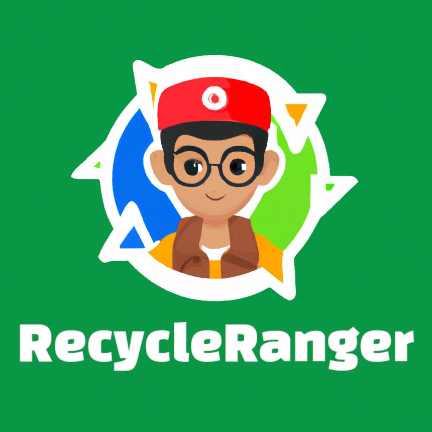

# RecycleRanger
RecycleRanger is a waste reduction and sustainability app for kids. It tracks waste and provides insights to educate and engage children in protecting the environment. Join the RecycleRanger community and start making a difference! 

# Project Structure
The various parts of the app are distributed in different branches.
Mainly we have:
- apiBackend	--> Backend: Rest API
- webapp	--> Frontend: Website
- android	--> Frontend: Android app
- main		--> Docs of the app

Any other branches are for feature development and deployment.
